Agora precisamos preparar este projeto para ter conteúdo.
Para isso, vamos criar um supper command de injeção de dados.
Este command deve injetar dados de todos os produtos, especificações técnicas, depoimentos, banners, serviços, quem somos, etc e tudo com imagens e tudo em 3 idiomas.
Antes disso, você vai precisar entender como os produtos são organizados, como as tabelas são construídas e como elas se relacionam.

## Produtos
Cada suproduto possui suas aplicações, seus itens de série, itens opcionais que precisam aparecer visualmente agradáveis no frontend.

Também existe a tabela de especificações técnicas de cada um dos subprodutos.

Os produtos são organizados em categorias e subdivididos em supprodutos.
veja isso tudo em

### Hierarquia de Produtos do Site (Mapa do Menu)

Para referência no layout do menu e das subpáginas, o site será estruturado com a seguinte hierarquia completa de produtos:

```mermaid
graph TD
    A[Produtos] --> B[Prensas Hidráulicas]
    A --> C[Prensas Servo-Hidráulicas]
    A --> D[Prensas Mecânicas]
    A --> E[Equipamentos]
    A --> F[Peças e Acessórios]

    B --> B1[Tipo C]
    B --> B2[Tipo C Duplo]
    B --> B3[4 Colunas]
    B --> B4[Tipo H]
    B --> B5[Especiais]

    C --> C1[Servo Bombas]

    D --> D1[Mecânicas ST/STC/STB/STV/STD...]
    D --> D2[Servo STA/STC/STD/STE]
    D --> D3[Alta Velocidade STS/MARX/MDH/DDH]

    E --> E1[Yokes Rebitagem/Puncionamento]
    E --> E2[Unidades de Força Mini/Stander/Especial]
    E --> E3[Cilindros Normatizados/Especiais]
    E --> E4[Transferência e Filtração]
    E --> E5[Plataformas]
    E --> E6[Tombadores]

    F --> F1[Hidráulica Bombas/Válvulas/Vedações/Filtros]
    F --> F2[Eletroeletrônica Automação/Potência]
    F --> F3[Acessórios NR12/Diversos]
```

### Detalhamento dos Modelos por Categoria (Subprodutos):

*   **Prensas Hidráulicas Tipo "C":**
    *   `PMC-ST` Stander
    *   `PMC-BC` Bancada
    *   `PMC-GT` Mesa Giratória
    *   `PMC-TR` Rebarbação e Calibração
    *   `PMC-MT` Mesa Móvel
    *   `PMC-AL` Alinhamento de Eixos
    *   `PMC-HZ` Horizontal
    *   `PMC-ES` Especial
*   **Prensas Hidráulicas Tipo "C Duplo":**
    *   `PMCD-ST` Stander
    *   `PMCD-GT` Mesa Giratória
    *   `PMCD-TR` Rebarbação e Calibração
    *   `PMCD-MT` Mesa Móvel
    *   `PMCD-BC` Bancada
    *   `PMCD-ES` Especial
*   **Prensas Hidráulicas 4 Colunas:**
    *   `PM4C-ST` Simples e Duplo Efeito
    *   `PM4C-RP` Duplo e Triplo Efeito (Paneleira)
    *   `PM4C-TR` Rebarbação e Calibração
    *   `PM4C-TY` Teste e Ajuste de Moldes
    *   `PM4C-PD` Pastilhadeira
    *   `PMH4-CT` Corte de Não Metálicos
    *   `PM4C-ES` Especial
*   **Prensas Hidráulicas Tipo "H":**
    *   `PMH-ST` Martelo Flutuante
    *   `PMH-PR` 4 e 8 Pontos
    *   `PMH-WK` Oficina (apenas motorizada, manual não)
    *   `PMH-WP` Pórtico
    *   `PMH-VB` Vulcanização
    *   `PMH-WT` Montagem de Pneus
    *   `PMH-ES` Especial
*   **Prensas Mecânicas (Mecânicas, Servo e Alta Velocidade):**
    *   Destaque para modelos industriais importados de parceiros como Schuler Group e Qiaosen Presses, com controle rígido de desativação lógica por fornecedor.

Identifique adequadamente cada uma das informações dos produtos documentados em docs/tabelas
Depois, identifique as mudanças necessárias nas entities e no sistema de cadastro de produtos e monte um plano de impletmentação para que os dados injetados sejam compatíveis com os dados que os produtos reais possuem, todos eles.
Depois, quando eu rodar esse command da produção, ele deve injetar corretamente cada um dos produtos.

Lembre-se que, no front, as tabelas precisam travar linha 1 e coluna 1

Oeganize tudo que será necessário enviar ao site e deixe dentro de uma pasta nova, seed.
Lembre-se que tudo que está na pasta docs não estará na produção.
Analise as imagens dos produtos existentes em docs/Enviado pelo cliente em 14-jul e identifique qual imagem é de qual produto para organizar adequadamente o envio da imagem certa ao sistema cquando injetar os dados.

revise todos os arquivos deste sistema em busca de informações que te ajudem a popular adequadamente o sistema.
Parte das informações dos produtos podem ser encontradas aqui: Neste arquivo: docs/documentos/Apresentação Corporativa 2026 - Pressmatik.pdf  e aqui docs/documentos/HIERARQUIA SITE PRESSMATIK.pdf

Cada subproduto possui o cadastro de um vídeo, que deverá ficar visível sem precisar clicar em uma aba. Faça bem bonito e elegante o front.

Atenção: Não teremos página específica de produto, na verdade, teremos as páginas dos sub-produtos.
Quando alguem acessar pela url um "produto" o sistema simplesmente mostra o subproduto principal.
Logo, em cada produto, no admin, deve ter um lugar pra informar qual o principal sub-produto.

## Quem somos
Neste arquivo: docs/documentos/Apresentação Corporativa 2026 - Pressmatik.pdf existe o material para criar o layout e o conteúdo da página de "quem somos".
Os dados devem ser todos administráveis e em 3 idiomas, e vc deve gerar o conteúdo completo pra injetar neste commmand, inclusive o logo dos principais fornecedores que devem ser extraídos do pdf, cada imagem, e injetados no painel administrativo (que deve existir também) de fornecedores no admin
inclusive o logo da sessão compromsso com a qualidade, devem ser extraídos do pdf, cada imagem, e injetados no painel administrativo (que deve existir também) de qualidade no admin

Deve ter um slider de imagens, para a galeria de imagens da infraestrutura.
Vc deve gerar individualmente cada uma delas e montar no injetor de dados para inserir adequadamente cada uma delas.

Os itens Missão, visão e valores devem ter visualmente a mesma estrutura visual, tipo blurb
E os diferenciais devem ter suas próprias estruturas visuais, tipo cartões, similares.
Isso tudo administrável, com imagens e tudo em 3 idiomas.

Monte um parágrafo e o gráfico (em 3 idiomas) da ESTRUTURA ORGANIZACIONAL.
Organize tudo para ser administrável pelo admin do sistema.

também deve ter um crud para CASES DE SUCESSO
E CLIENTES DE DESTAQUE, para cadastrar os logos e aparecem no front, em quem somos.

Reserve uma área no admin para colocar o vídeo do quem somos, em 3 idiomas.
O vídeo estará no youtube.

Contrua o layout do quem somos para que tenha tudo que eu pedi, admistrável e lindo, com efeitos, animações, tudo que uma página desse tipo precisa. Não tenha pressa de terminar, precisa ser primoroso.

O gerenciador do conteúdo do "Quem somos" no admin, deve poder cadastrar os dados tanto da página do quem somos mesmo quanto da sessão do quem somos da home, com imagem, texto, blurbs.

## Demais áreas
Neste sistema, ainda precisam ser administráveis e em 3 idiomas, com os dados inseridos pelo seed:

 - Noticias
 - Depoimentos
 - Banners
 - Contatos feitos (tanto de contatos como de cotações)

## Formulários
Obrigar adicionar o CPF e o CNPJ nos formulários de contato dentro dos subprodutos.

## Outros
onde for necessário um sistema de escolha de ícones, como os blurbs da home, Segurança Avançada e Engenharia e Tecnologia Siemens, icones na página de quem somos, Diferenciais Técnicos, deve usar a mesma forma de escolher ícones deste sistema:
/Users/jonaspoli/work/wab-sites
No admin, os itens que podem ser ordenados, com o campo position, este campo não aparece no form e deverá ser possível clicar e arrastar para resposicionar, como neste projeto /Users/jonaspoli/work/wab-sites

todo o conteúdo deste site deve ser administrável, em 3 idiomas, e com imagens.
Todo este conteúdo, completo, deve ser injetado pelo novo command que estamos criando.
