# Planejamento Estrutural e Arquitetura do Novo Site da Pressmatik

Este documento apresenta as diretrizes de design, layout e arquitetura de informação para o desenvolvimento do novo site institucional da **Pressmatik**. O planejamento baseia-se nas reuniões de escopo, propostas comerciais, análise de concorrência e hierarquia de produtos fornecidas pela empresa.

---

## 1. Visão Geral e Diretrizes de Tecnologia
O novo site institucional da Pressmatik tem como objetivo refletir sua posição de destaque no mercado (empresa líder em vendas frente aos concorrentes diretos) e consolidar sua presença digital de forma moderna, limpa e técnica.

*   **Tecnologia Proposta:** Desenvolvimento em **Symfony** (PHP). Essa escolha garante maior segurança contra invasões (um problema enfrentado no site anterior), código modular, melhor indexação e performance para SEO, reduzindo os custos de campanhas de Google Ads devido à melhor classificação de página.
*   **Gestão de Conteúdo (Área Administrativa):** Autonomia para a equipe da Pressmatik gerenciar conteúdos como cadastro/edição de produtos, notícias/eventos, controle de usuários (Administrador, Editor) e parceiros.
*   **Internacionalização (Multilíngue):** O site nascerá preparado para múltiplos idiomas. Os idiomas iniciais serão **Português (PT)**, **Inglês (EN)** e **Espanhol (ES)**, com arquitetura pronta para expansões futuras (como Alemão).

---

## 2. Identidade Visual e Conceito de Design
O design deve transmitir **robustez industrial, tecnologia e alta performance**.

*   **Estilo Visual:** Linhas sóbrias, limpas, minimalistas e organizadas. O cliente definiu a preferência por um visual de **"Estilo Americano"**, baseado nas seguintes referências:
    *   [Beckwood Press](https://beckwoodpress.com/) (Referência principal para rodapé e layout limpo)
    *   [Savage Press](https://www.savagepress.com/)
    *   [Sutherland Presses](https://www.sutherlandpresses.com/#/)
*   **Uso de Cores:** **Evitar o uso excessivo ou fundos na cor vermelha**. A paleta de cores deve focar em tons mais frios, escuros ou metálicos (característicos do setor metal-mecânico e de automação premium), utilizando o vermelho apenas em pontos muito específicos e estratégicos de destaque (como pequenos botões de call-to-action ou sinalizações de segurança), se estritamente necessário.
*   **Comunicação de Valores (Mitigação de Paradigmas):**
    *   O design e a escrita devem esclarecer ativamente as principais preocupações dos clientes da Pressmatik: as prensas hidráulicas atuais são **rápidas, altamente produtivas, seguras (atendendo às normas NR10 e NR12)** e utilizam componentes hidráulicos/elétricos de primeira linha (ex: Bosch Rexroth, Siemens, Weg).
    *   Desmistificar o paradigma de que prensas hidráulicas "vazam óleo" ou são "lentas" em comparação com prensas mecânicas excêntricas perigosas e de alto desgaste.

---

## 3. Estrutura do Layout da Home Page (Página Inicial)

### O que PRECISA ter no layout da Home:
1.  **Header (Cabeçalho):**
    *   Logotipo da Pressmatik visível e em alta resolução.
    *   Menu de navegação claro e simplificado: *Início*, *Empresa*, *Produtos*, *Serviços*, *Aplicações*, *Blog (Notícias)* e *Contato*.
    *   Seletor de idioma intuitivo (PT / EN / ES).
    *   Botão em destaque para solicitação rápida de orçamento.
2.  **Botão Flutuante do WhatsApp:** Visível em todas as páginas para contato comercial direto.
3.  **Banner Principal (Destaque):**
    *   Slide ou vídeo de fundo de alta qualidade mostrando as máquinas em operação.
    *   Frase de impacto focando em tecnologia, produtividade e alta performance.
4.  **Quem Somos (Apresentação Curta):**
    *   Breve contextualização sobre a Pressmatik e sua trajetória no mercado metalúrgico.
    *   Link para a página institucional completa da empresa.
5.  **Nossos Diferenciais (Destaques Técnicos):**
    *   Seção com ícones e textos explicativos de rápida leitura focada nos pontos que respondem às dores do cliente:
        *   **Normas de Segurança:** Conformidade total com NR12 e NR10.
        *   **Componentes de Qualidade:** Utilização de marcas globais líderes (Siemens, Bosch Rexroth, Weg).
        *   **Alta Performance:** Substituição de tecnologia antiga (mecânica) por prensas hidráulicas modernas de alta produtividade e menor custo de manutenção (setup rápido, maior vida útil do ferramental).
6.  **Grade de Destaque de Produtos:**
    *   **Prensas Hidráulicas (Destaque Principal):** Exposição em cartões (cards) premium das categorias principais (Tipo C, Tipo C Duplo, 4 Colunas e Tipo H).
    *   **Prensas Servo-Hidráulicas (Destaque Principal):** Apresentação das linhas de alta tecnologia (Servo Bombas).
7.  **Grade Secundária de Produtos:**
    *   Cards menores ou seção em carrossel para *Equipamentos* (Yokes, Cilindros, Unidades de Força, etc.) e *Peças e Acessórios*.
8.  **Seção de Serviços:**
    *   Apresentação clara dos serviços prestados (Manutenção, Reforma de Máquinas, Adequação à NR12). A divisão clara entre produtos e serviços é essencial.
9.  **Módulo de Notícias e Eventos (Blog):**
    *   Apresentação dos últimos 3 posts ou novidades (eventos corporativos, participação em feiras como Feimec, Expomafe e Mercopar).
10. **Depoimentos de Clientes:**
    *   Carrossel de depoimentos contendo o texto, nota em estrelas (ratings), foto ou iniciais, nome do depoente, cargo e empresa.
11. **Nossos Clientes (Logos):**
    *   Grade em tons de cinza com logotipos de clientes de destaque que utilizam as prensas Pressmatik.
12. **Formulário de Contato e Mapa:**
    *   Campos simples de preenchimento (Nome, E-mail, Telefone, Mensagem).
    *   Endereço da fábrica em Araraquara-SP e mapa interativo do Google Maps.
13. **Rodapé Premium ("Estilo Americano"):**
    *   Rodapé robusto com fundo escuro, contendo links de navegação para todas as soluções e subprodutos, dados de contato e links para redes sociais (LinkedIn, Instagram, YouTube).

### O que NÃO PRECISA ou NÃO DEVE ter no layout da Home:
*   **Layout Poluído ou Excesso de Elementos Visuais:** O site atual é considerado poluído; o novo deve respirar, com bom uso de espaços em branco.
*   **Fundo Vermelho ou Uso Excessivo da Cor:** Nada de seções inteiras em vermelho vivo. O vermelho é um aviso e um elemento de destaque, não a cor base do site.
*   **Integração Automática do Feed do Instagram:** A extração contínua é tecnicamente instável e polui o visual com posts não institucionais. O gerenciamento de notícias deve ser feito diretamente no painel administrativo do site.
*   **Menção a Prensas Manuais, de Reciclagem ou Oficinas de Pequeno Porte:** O mercado da Pressmatik é industrial pesado. A linguagem e o visual não devem atrair clientes em busca de prensas manuais ou de reciclagem comercial básica.

---

## 4. Estrutura do Layout da Página de Detalhes de Produtos

Devido à complexidade e especificidade das máquinas industriais, cada modelo de produto terá uma estrutura semelhante a uma **Landing Page de Alta Conversão**, detalhando extensamente suas capacidades técnicas.

### O que PRECISA ter no layout de Detalhe de Produtos:
1.  **Breadcrumbs (Caminho de Navegação):**
    *   Essencial para que o usuário se localize no site de forma hierárquica.
    *   *Exemplo:* `Home > Produtos > Prensas Hidráulicas > Tipo C > Modelo PMC-ST`
2.  **Introdução da Linha/Categoria:**
    *   Antes de entrar nos modelos específicos, cada categoria (ex: Tipo C) deve conter uma breve descrição conceitual de aplicação (explicando onde e como essas máquinas são utilizadas na indústria).
3.  **Apresentação Principal do Modelo (Above the Fold):**
    *   Nome do modelo em destaque (ex: *PMC-ST Stander*).
    *   Especificação principal visível: **Faixa de Tonelagem** (ex: *25 ~ 315 Ton*).
    *   Imagem principal em alta definição com zoom técnico.
    *   Botão destacado de **"Solicitar Orçamento Deste Modelo"**.
    *   Botão visível de **"Baixar Catálogo Técnico em PDF"**.
4.  **Galeria de Mídia (Fotos e Vídeos):**
    *   Galeria de fotos detalhando os componentes do produto em múltiplos ângulos.
    *   Sinalização ou botão de **"VER VÍDEOS"** para carregar vídeos do maquinário operando em ambiente de fábrica.
5.  **Especificações Técnicas e Funcionalidades (Tabelas e Abas):**
    *   **Features Standard (Recursos Inclusos):** Lista clara de componentes e recursos que vêm de fábrica na máquina.
    *   **Features Optional (Recursos Opcionais):** Acessórios e modificações que podem ser encomendados à parte pelo cliente.
    *   Tabela com especificações físicas e mecânicas (dimensões de mesa, curso do martelo, potência do motor, etc.).
6.  **Botão de Envio de E-mail / Compartilhamento:**
    *   Permitir que o engenheiro ou comprador compartilhe a página do produto ou envie as especificações por e-mail diretamente.
7.  **Formulário de Cotação Rápida no Pé da Página:**
    *   Um formulário específico integrado que já envia ao comercial qual modelo o cliente estava visualizando no momento do envio.
8.  **Vínculo com Fornecedor (Regra de Negócio de Back-end):**
    *   Exibição ou ocultação baseada no fornecedor. Se a Pressmatik parar de trabalhar com um parceiro internacional (ex: *Qiaosen*), a inativação deste fornecedor no painel administrativo deve remover ou ocultar de forma automática todos os produtos e subprodutos importados dele.

### O que NÃO PRECISA ou NÃO DEVE ter no layout de Detalhes:
*   **Preços Diretos e Compras Online (E-commerce):** As máquinas são B2B, altamente personalizáveis e vendidas sob consulta técnica. Não deve haver botões de "Comprar" ou exibição de preços.
*   **Informações Técnicas Genéricas:** Cada subproduto deve ter sua própria ficha técnica. Páginas que agrupam vários modelos diferentes sem especificações específicas devem ser evitadas.
*   **Downloads de PDFs Não Relacionados:** O catálogo PDF para download deve ser rigorosamente o do modelo ou da linha de produto visualizada.

---

## 5. Hierarquia de Produtos do Site (Mapa do Menu)

Para referência no layout do menu e das subpáginas, o site será estruturado com a seguinte hierarquia completa de produtos:

```mermaid
graph TD
    A[Produtos] --> B[Prensas Hidráulicas]
    A --> C[Prensas Servo-Hidráulicas]
    A --> D[Prensas Mecânicas]
    A --> E[Equipamentos]
    A --> F[Peças e Acessórios]

    B --> B1[Tipo C]
    B --> B2[Tipo C Duplo]
    B --> B3[4 Colunas]
    B --> B4[Tipo H]
    B --> B5[Especiais]

    C --> C1[Servo Bombas]

    D --> D1[Mecânicas ST/STC/STB/STV/STD...]
    D --> D2[Servo STA/STC/STD/STE]
    D --> D3[Alta Velocidade STS/MARX/MDH/DDH]

    E --> E1[Yokes Rebitagem/Puncionamento]
    E --> E2[Unidades de Força Mini/Stander/Especial]
    E --> E3[Cilindros Normatizados/Especiais]
    E --> E4[Transferência e Filtração]
    E --> E5[Plataformas]
    E --> E6[Tombadores]

    F --> F1[Hidráulica Bombas/Válvulas/Vedações/Filtros]
    F --> F2[Eletroeletrônica Automação/Potência]
    F --> F3[Acessórios NR12/Diversos]
```

### Detalhamento dos Modelos por Categoria (Subprodutos):

*   **Prensas Hidráulicas Tipo "C":**
    *   `PMC-ST` Stander
    *   `PMC-BC` Bancada
    *   `PMC-GT` Mesa Giratória
    *   `PMC-TR` Rebarbação e Calibração
    *   `PMC-MT` Mesa Móvel
    *   `PMC-AL` Alinhamento de Eixos
    *   `PMC-HZ` Horizontal
    *   `PMC-ES` Especial
*   **Prensas Hidráulicas Tipo "C Duplo":**
    *   `PMCD-ST` Stander
    *   `PMCD-GT` Mesa Giratória
    *   `PMCD-TR` Rebarbação e Calibração
    *   `PMCD-MT` Mesa Móvel
    *   `PMCD-BC` Bancada
    *   `PMCD-ES` Especial
*   **Prensas Hidráulicas 4 Colunas:**
    *   `PM4C-ST` Simples e Duplo Efeito
    *   `PM4C-RP` Duplo e Triplo Efeito (Paneleira)
    *   `PM4C-TR` Rebarbação e Calibração
    *   `PM4C-TY` Teste e Ajuste de Moldes
    *   `PM4C-PD` Pastilhadeira
    *   `PMH4-CT` Corte de Não Metálicos
    *   `PM4C-ES` Especial
*   **Prensas Hidráulicas Tipo "H":**
    *   `PMH-ST` Martelo Flutuante
    *   `PMH-PR` 4 e 8 Pontos
    *   `PMH-WK` Oficina (apenas motorizada, manual não)
    *   `PMH-WP` Pórtico
    *   `PMH-VB` Vulcanização
    *   `PMH-WT` Montagem de Pneus
    *   `PMH-ES` Especial
*   **Prensas Mecânicas (Mecânicas, Servo e Alta Velocidade):**
    *   Destaque para modelos industriais importados de parceiros como Schuler Group e Qiaosen Presses, com controle rígido de desativação lógica por fornecedor.

